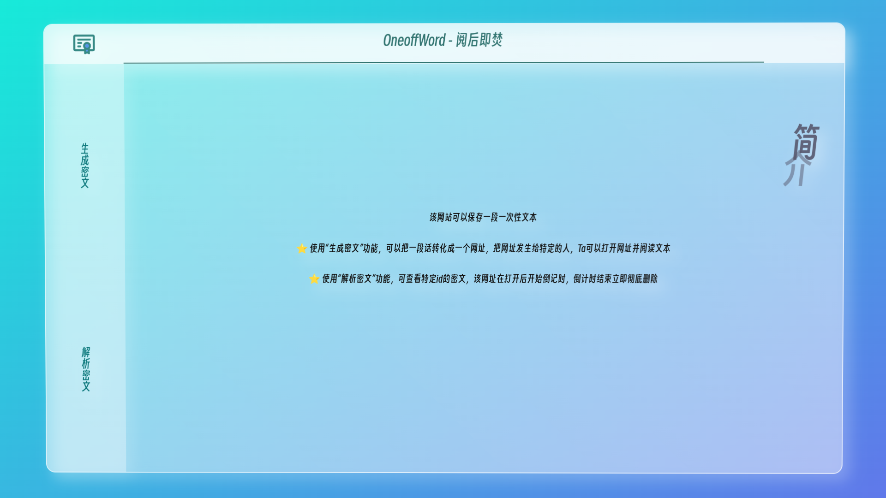
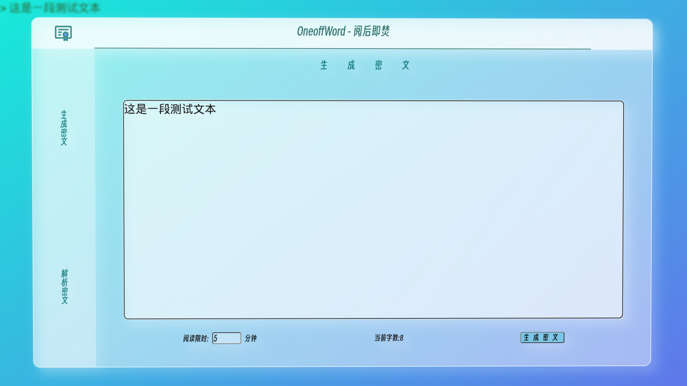
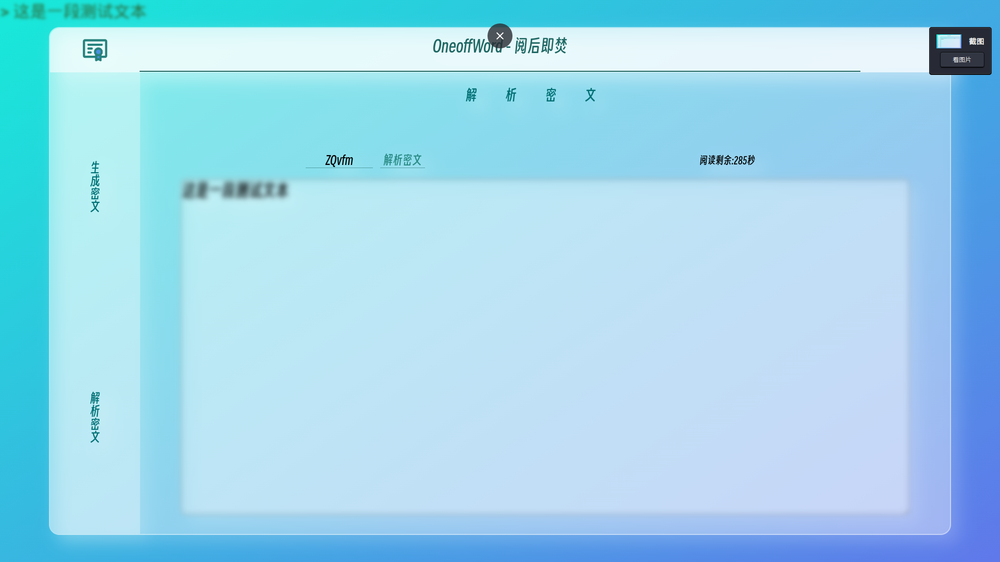

# OneOffWord
阅后即焚

## 简介  
某科目的结课作业  

## 运行环境  
[Apache-tomcat-9.0.55](https://tomcat.apache.org/download-90.cgi)  
[java17.0.4](https://www.oracle.com/java/technologies/downloads/)  

## 数据库配置 
[create_sql.md](./create_sql.md)  

## 运行项目  
+ [下载](https://github.com/xmexg/OneOffWord/releases)war包
+ 根据[这篇文章](https://www.bt.cn/bbs/thread-76217-1-1.html)运行项目

## 效果演示  
+ 首页  
  

+ 生成密文  
  

+ 解析密文  
  

+ 密文模糊  
  
